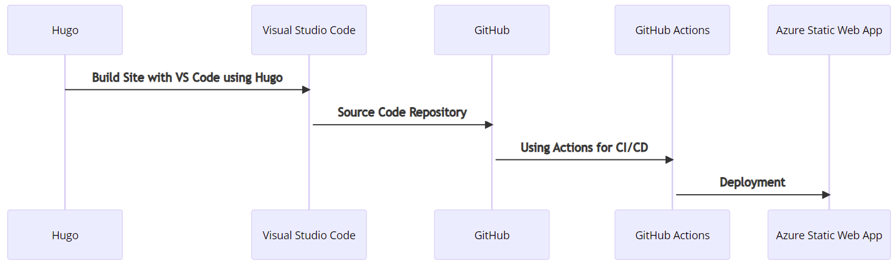

+++
title = "About Pulse Site"
description = "How Pulse was built!"
date = "2020-06-06"
aliases = ["about-me", "about-pulse", "pulse"]
author = "Yaheya Quazi"
+++

This site is built various technologies and platforms. They are - 

<ul>

<li><a href="https://gohugo.io/" target="_whole">Hugo</li>
<li>Theme : <a href="https://gitlab.com/avron/gruvhugo" target="_whole">GruvHugo</a>
<li><a href="http://www.github.com" target="_whole">Github</a></li>
<li>Github <a href="https://docs.github.com/en/actions" target="_whole">Actions</a></li>
<li><a href="https://azure.microsoft.com/en-us/services/app-service/static/" target="_whole">Azure Static Web App</a></li>
<li><a href="https://code.visualstudio.com/" target="_whole">Visual Studio Code</a></li>

</ul>

Image below demonstrates the general flow - 
