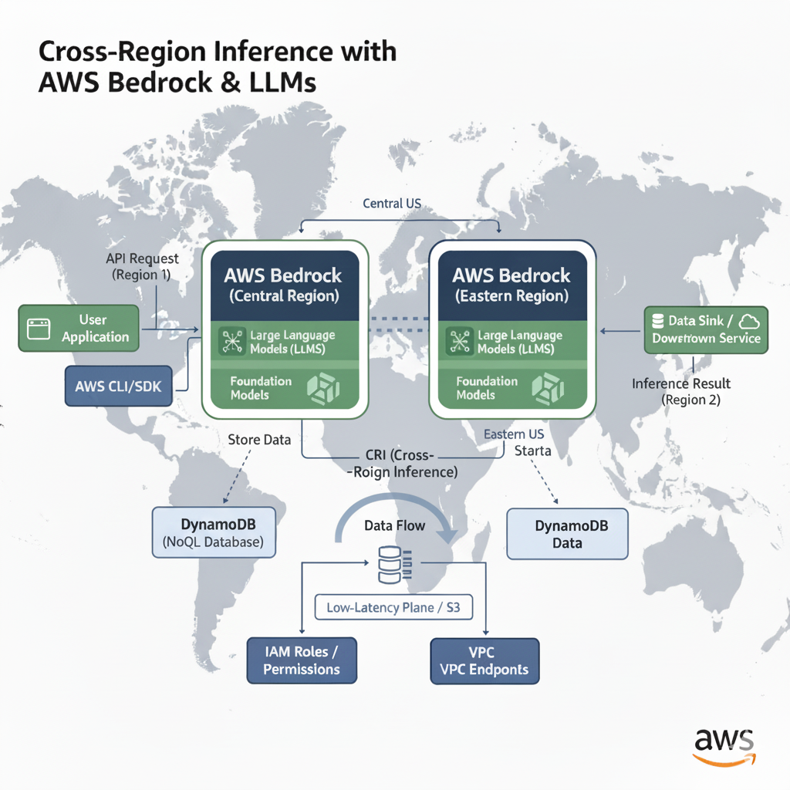

+++
author = "Yaheya Quazi"
title = "Bedrock's Game Changer: Why Cross-Region LLM Inference is a Must-Have"
date = "2025-10-07"
description = "Bedrock's Game Changer: Why Cross-Region LLM Inference is a Must-Have"
tags = [
"technology",
"bedrock",
"LLM"
]
+++

As Chief Software Architect at UC Santa Barbara, I focus on integrating cutting-edge cloud features like AWS Bedrock. For enterprise LLM deployment, we must solve three non-negotiables: latency, data gravity, and resiliency.

Cross-region inference in Bedrock is the definitive answer, moving LLM strategy from experiment to production-grade architecture.

<strong>The Pillars of Multi-Region LLM Architecture</strong>
1. High Resiliency and Failover
Single-region deployment is a critical vulnerability. Cross-region inference allows immediate, automatic failover (e.g., from us-east-1 to us-west-2). This maintains API parity and model consistency across geographies, guaranteeing uninterrupted service for critical applications.

2. Data Gravity and Compliance
International operation mandates that data processing often occurs where the data resides (Data Gravity). This is essential for compliance (e.g., GDPR). Cross-region inference lets us run the same foundational model locally (e.g., in eu-central-1), keeping prompts and responses within necessary jurisdictional boundaries while standardizing the service platform.

3. Global Latency Optimization
For interactive applications, every millisecond counts. By intelligently routing user requests to the closest available and operational endpoint, cross-region deployment minimizes network latency. This ensures a fast, consistent, and performant user experience for a global user base.

<strong>The Architect’s Mandate</strong>
Bedrock handles the model deployment complexity. Our focus shifts to the infrastructure:

<strong>Smart Routing:</strong> Using services like Route 53 for latency-based routing to the fastest region.

<strong>Global State:</strong> Ensuring conversational state (chat history) is managed in a globally replicated, low-latency data store (like DynamoDB Global Tables).

Cross-region inference is the essential capability for building the next generation of resilient, compliant, and globally distributed LLM applications.

What are your thoughts on state management in this multi-region environment? Let's connect.

#AWS #Bedrock #LLM #SoftwareArchitecture #CloudComputing #UCSB
